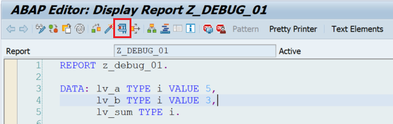
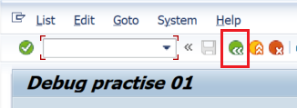
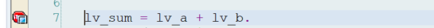
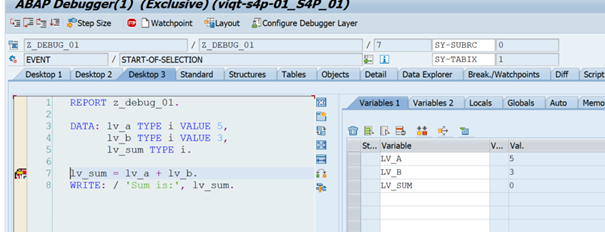
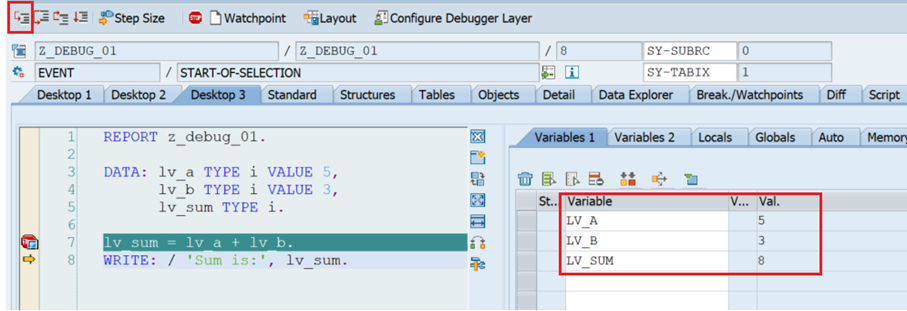
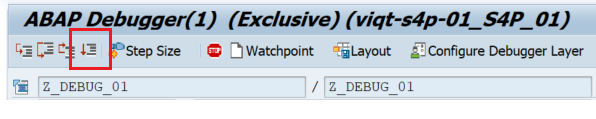

# Debug Task 01

There’s no bug in this task.

## Steps

1. In **SAP GUI** transaction `SE38`, enter `z_debug_01`, and click **Display**.  

2. Run the program by clicking **Direct Processing** or by pressing **F8**. 
 
3. Examine the output.  

4. Go back by clicking **Back** or pressing **F3**.  

5. Put a breakpoint on **line 7** and run the program again. 
 
6. Once the program runs in debugger mode, it stops at line 7.  
   - Double-click on `lv_a`, `lv_b`, and `lv_sum` to see the values of each variable.  
   
7. Press **Single Step** or **F5** once. Examine how the value for `lv_sum` changes.  

8. Press **Continue** or **F8** again so the program executes.  

