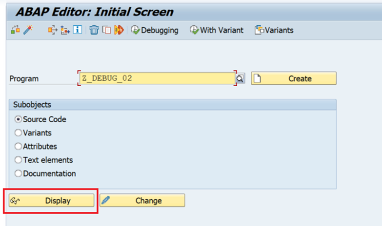
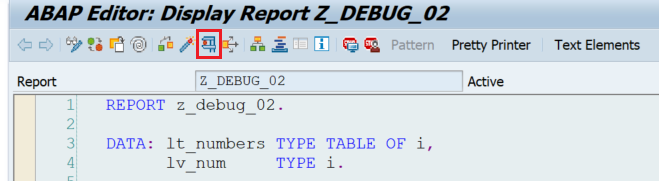
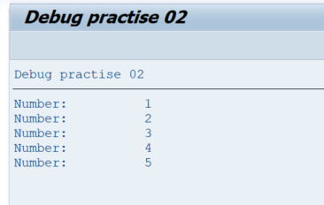
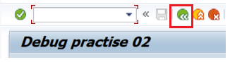
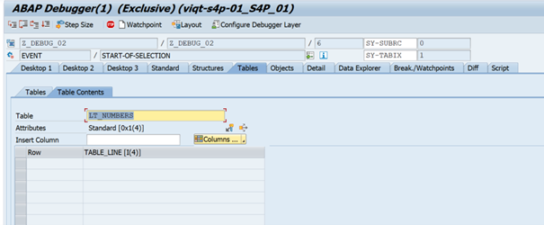
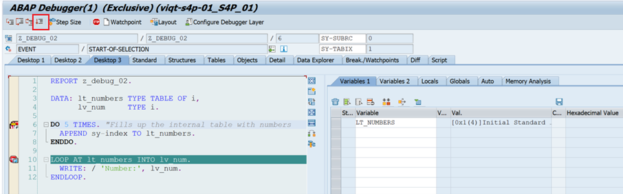
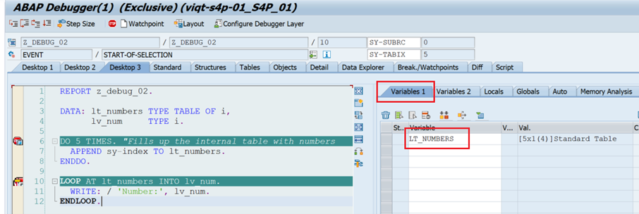
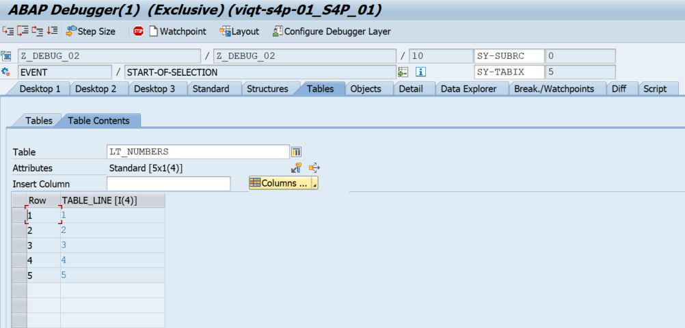

# Debug Task 02

There’s no bug in this task.

## Steps

1. In **SAP GUI** transaction `SE38`, enter `z_debug_02`, and click **Display**.  

2. Run the program by clicking **Direct Processing** or by pressing **F8**.  

3. Examine the output.  

4. Go back by clicking **Back** or pressing **F3**.  

5. Put breakpoints on **line 6** and **line 10**, then run the program again.  

6. Once the program runs in debugger mode, it stops at line 6.  
   - Double-click on `lt_number` to examine its current value.  
   - Double-click on `lt_numbers` in the **Variables 1** table. This opens the **Table Contents** tab of the debugger. Examine the empty table.  

7. Navigate back to the main debugger view (press **Back**, or press **F3**, or click on **Desktop 1** / **Desktop 3**).  
8. Press **Continue** or **F8**. 

9. In the **Variables 1** table, double-click on `lt_numbers` again. Examine the values of the internal table.

10. Navigate back to the main debugger view (press **Back**, or press **F3**, or click on **Desktop 1** / **Desktop 3**).  
11. Press **Continue** or **F8** to let the program finish executing.  

