# Debug Task 03

There’s no bug in this task.

## Steps

1. In **SAP GUI** transaction `SE38`, enter `z_debug_03`, and click **Display**.  

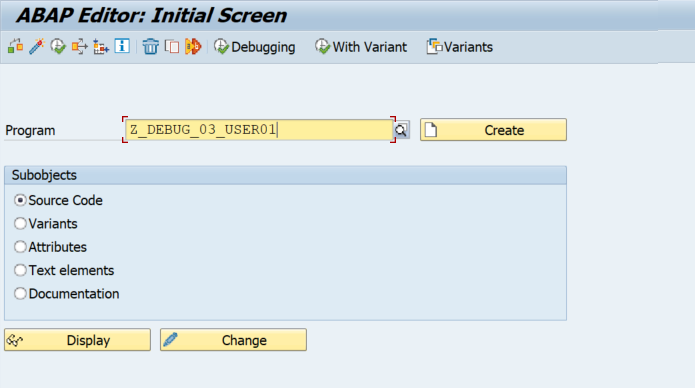

2. Run the program by clicking **Direct Processing** or by pressing **F8**.  

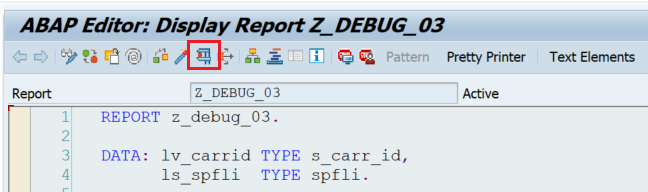

3. Leave `P_CARRID` with value `LH`, click on **Execute** or press **F8**.  

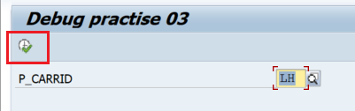

4. Examine the output.  

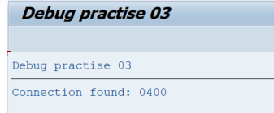

5. Go back by clicking **Back** or by pressing **F3** twice to see the report.  
6. Put a breakpoint on **line 8**. Start the debugger by clicking **Direct Processing** or pressing **F8**.  

7. Leave `P_CARRID` with value `LH`, click on **Execute** or press **F8**.  
8. Double-click on `ls_spfli` and `p_carrid` to see their values.  

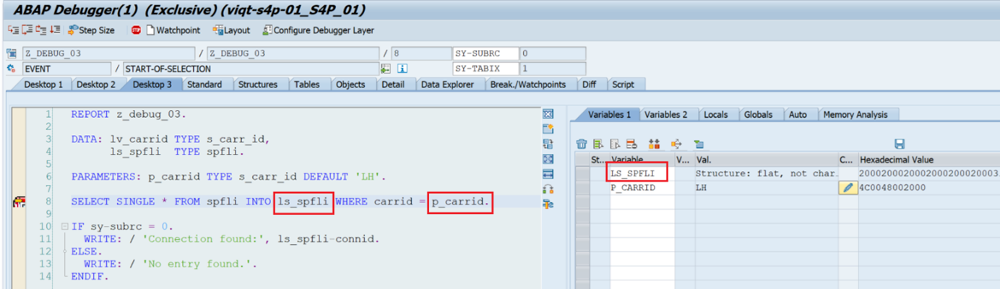

9. In the **Variables 1** table, double-click on `ls_spfli` again to examine the values of the internal table.  

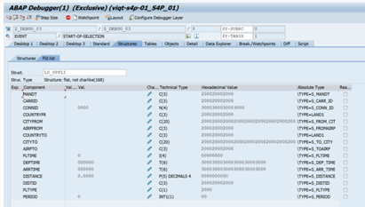

10. Navigate back to the main debugger view (press **Back**, or press **F3**, or click on **Desktop 1** / **Desktop 3**).  
11. Let the program execute by pressing **Continue** or **F8**.  

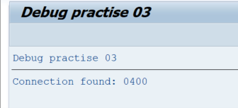

12. Once the program executed, navigate back to the report (press **Back** or **F3** twice).  
13. Click on the **Change/Display** button or press **CTRL + F1**. The screen should turn white. This allows you to make modifications to the report.  

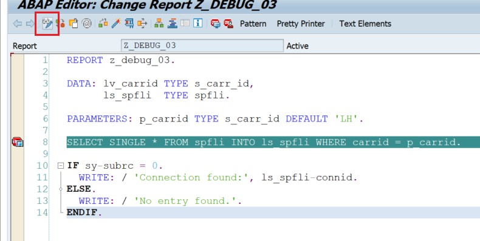

14. In **line 6**, change `DEFAULT 'LH'` to `DEFAULT 'AB'`.  

15. Click **Activate** or press **CTRL + F3**. Once the report is activated, go back to display mode by clicking **Change/Display** or by pressing **CTRL + F1**.  

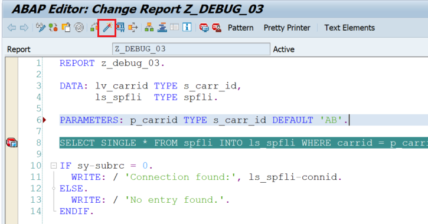
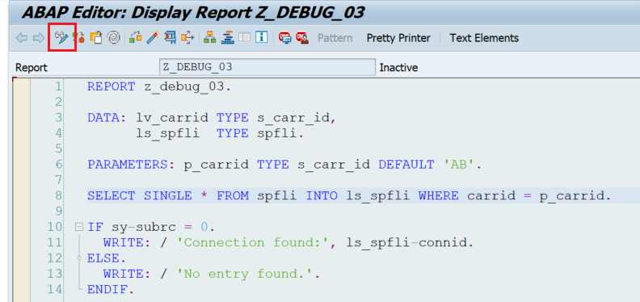

16. Leave the debugger on **line 8** (or put it there again if it’s gone). Run the program by clicking **Direct Processing** or by pressing **F8**.  
17. Click **Execute** or press **F8**.  

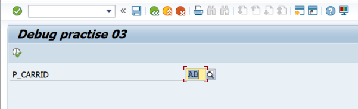

18. Examine the values for `ls_spfli` and `p_carrid` again.  

19. Click **Execute** or press **F8**.  
20. Examine the final output.  

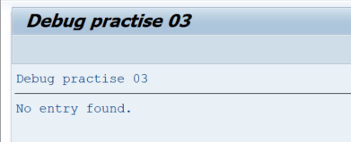
