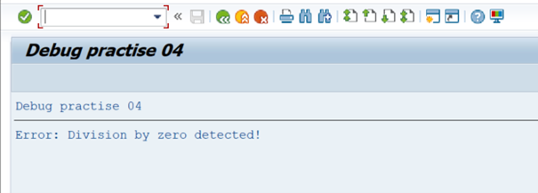
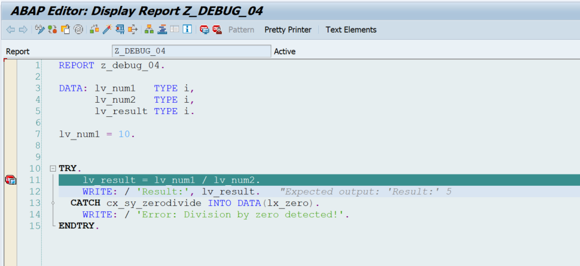
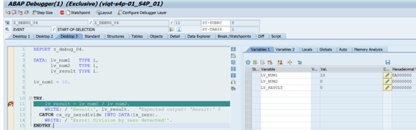
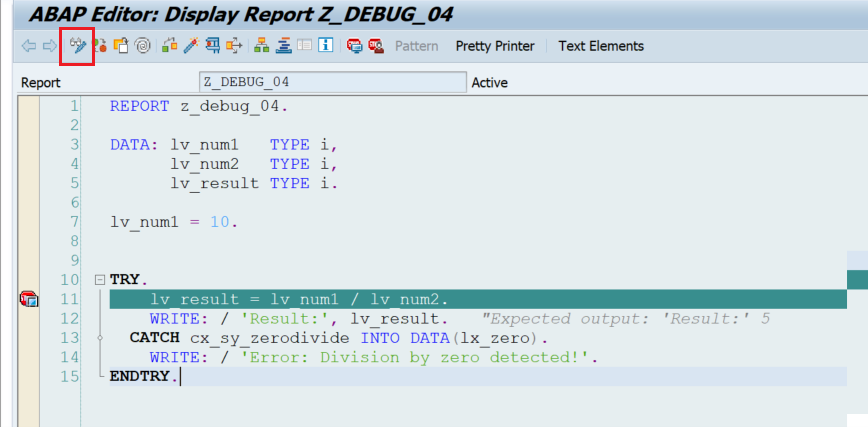
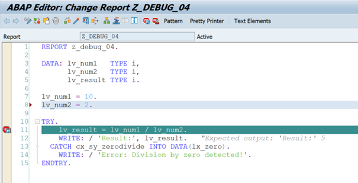
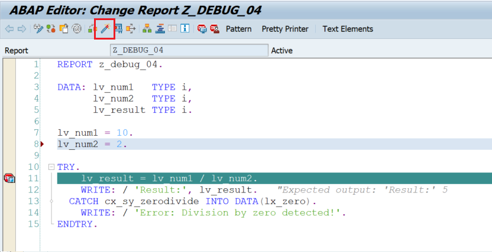
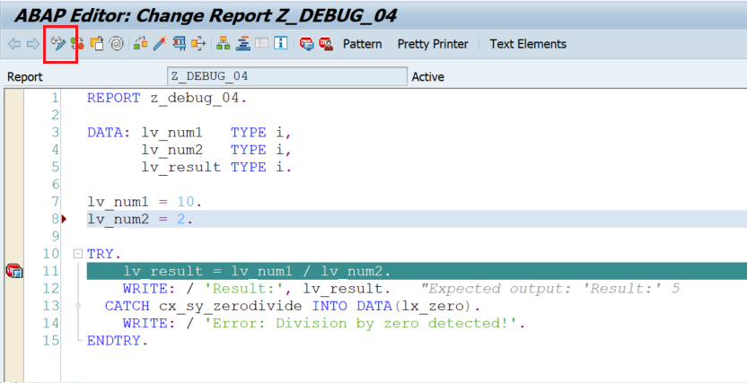
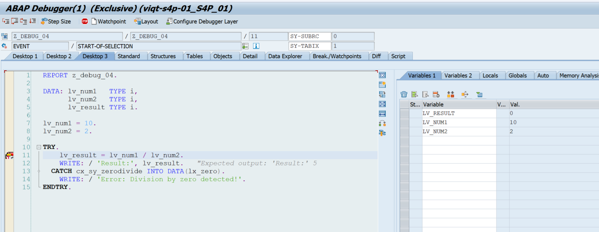
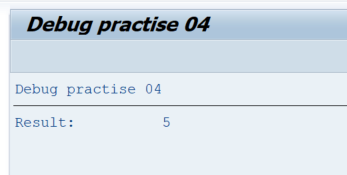

# Debug Task 04

Add your own user number after the report name instead of XZ. For example, ‘Z_DEBUG_04_USER01’.

## Steps

1. In **SAP GUI** transaction `SE38`, enter `Z_DEBUG_04_USERXZ`, and click **Display**.  
2. Run the program by clicking **Direct Processing** or by pressing **F8**.  
3. Examine the output.  

4. Go back to the report (press **Back** or **F3**).  
5. Put a breakpoint on **line 11**, and run the report by clicking **Direct Processing** or pressing **F8**. 

6. Examine the values of variables `lv_result`, `lv_num1`, and `lv_num2`.  

7. `lv_num2` doesn`t have an assigned value. Therefore the division result in an error.
8. Go back to the report page (‘Back’ or ‘F3’).
9. Click on ‘Display/Change’ or press ‘CTRL + F1’. The screen should turn white.

10. On line 8, add the following code:
`lv_num2 = 2.`

11. Click Activate

12. Click `Display/Change` or press `CTRL + F1`.

13. Make sure you have a debugger point on line 11. Click `Direct processing` or press `F8`.
14. Examine the values for `lv_num1`, `lv_num2` and `lv_result`.

15. Click `Direct processing` or press `F8`. Examine the output.

