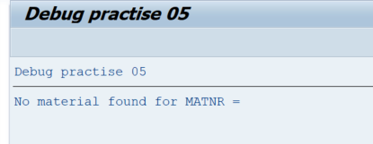
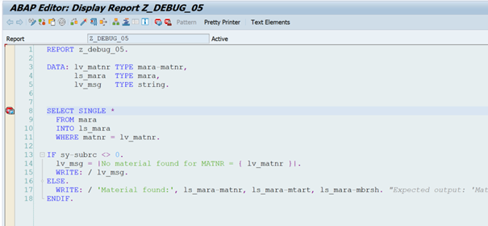
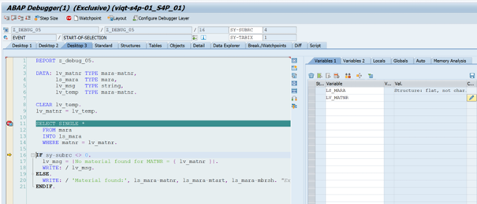
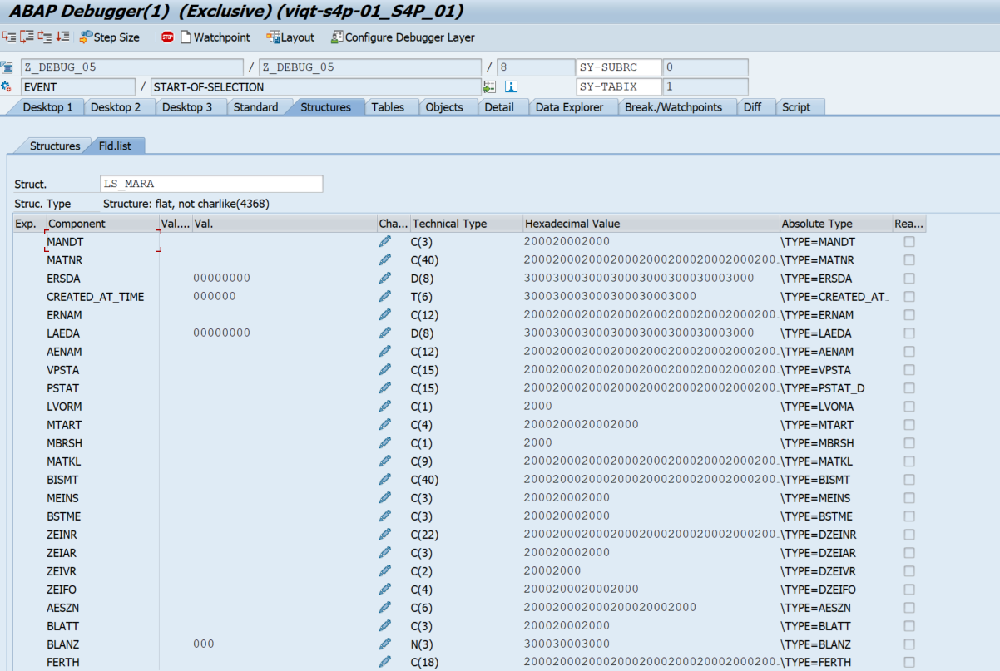
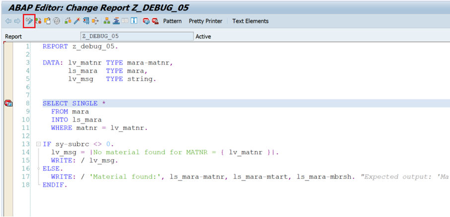
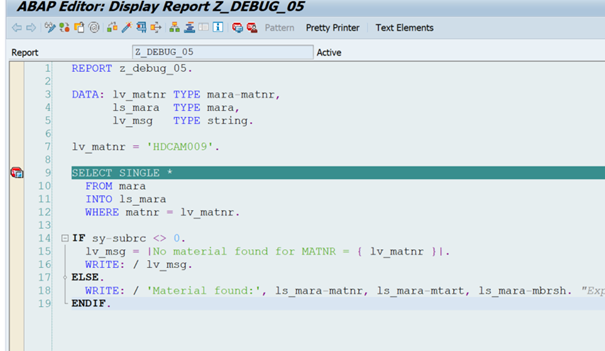
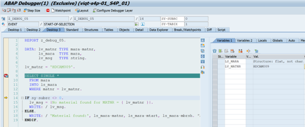
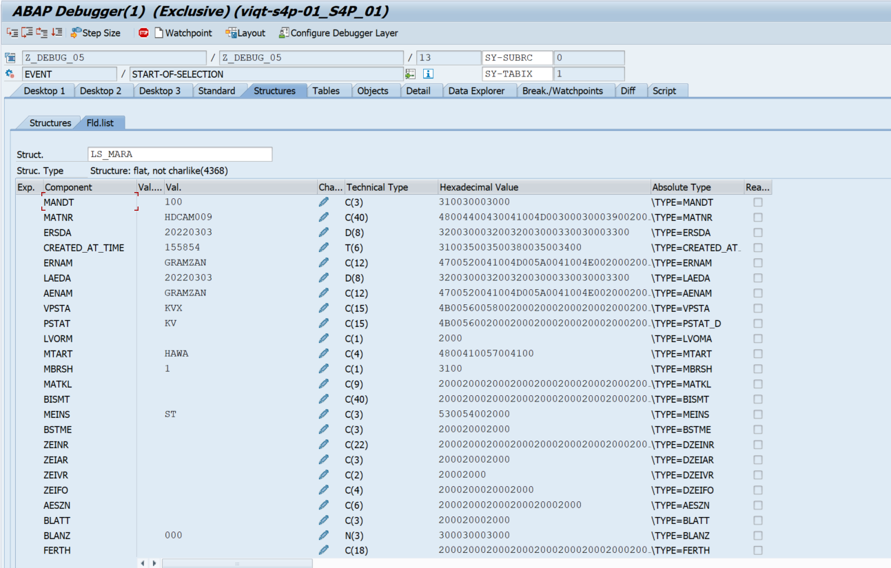
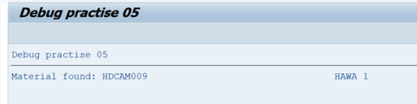

# Debug Task 05

Add your own user number after the report name instead of XZ. For example, ‘Z_DEBUG_05_USER01’.

## Steps

1. In **SAP GUI** transaction `SE38`, enter `Z_DEBUG_05_USERXZ`, and click **Display**.  
2. Run the program by clicking **Direct Processing** or by pressing **F8**.  
3. Examine the output.  

4. Put a breakpoint on **line 8**. Run the program by clicking **Direct Processing** or by pressing **F8**.  

5. Examine the variables of the `SELECT SINGLE` statement (`ls_mara` and `lv_matnr`). Press **Single Step** or **F5** to let the SELECT statement fill up with values.  

6. `lv_matnr` is empty, therefore the SELECT statement yields no result.  
7. Click **Execute** or press **F8** so the report is processed.  
8. Go back to the report page (**Back** or **F3**).  
9. Click on **Display/Change**, or press **CTRL + F1**. The screen should turn white, and the source code should be editable. 

10. On **line 7**, add the following line:  
`lv_matnr = 'HDCAM009'.`

11. Click **Activate** or press **CTRL + F3**. Click on **Display/Change**, or press **CTRL + F1**. The screen should turn back to blue, and the source code should not be editable anymore.  
12. Make sure you have a debugger set before the `SELECT SINGLE *` line.  

13. Click on **Direct Processing** or press **F8**.  
14. Inspect the variables `ls_mara` and `lv_matnr` again. You might need to press **Single Step** or **F5** so the variables fill up with values.

15. Click **Continue** or press **F8**.  
16. Examine the output.  

