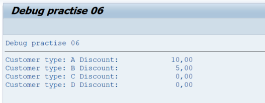
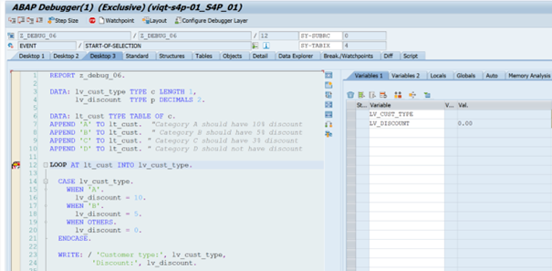
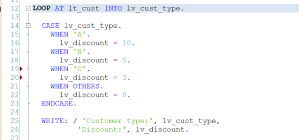
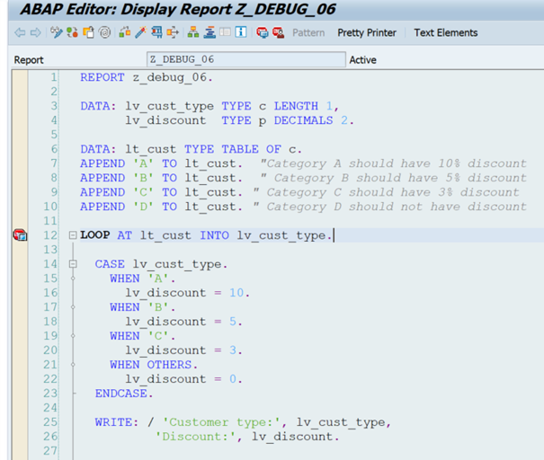
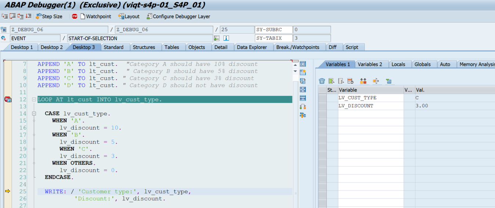
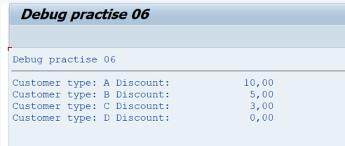

# Debug Task 06

Add your own user number after the report name instead of XZ. For example, ‘Z_DEBUG_06_USER01’.

## Steps

1. In **SAP GUI** transaction `SE38`, enter `Z_DEBUG_06_USERXZ`, and click **Display**.  
2. Take some time to observe the report to understand the expected outcome. Run the program by clicking **Direct Processing** or by pressing **F8**.  
3. Examine the output.  



4. Go back to the report, and put a debugger point on **line 12**.  
5. Run the program by clicking **Direct Processing** or by pressing **F8**.  
6. Double-click on variables `lv_cust_type` and `lv_discount` to see their values during processing.  



7. Click **Single Step** or press **F5** a couple of times, and observe how the values for `lv_cust_type` and `lv_discount` are changing. Run the debugging process multiple times if necessary.  


8. There is no CASE statement specifying how to resolve if the value is `'C'`.  
9. Click **Execute** or press **F8** so the report is processed.  
10. Go back to the report page (**Back** or **F3**).  
11. Click on **Display/Change**, or press **CTRL + F1**. The screen should turn white, and the source code should be editable.  
12. In **lines 19 and 20**, add the following code:

```abap
WHEN 'C'.
  lv_discount = 3.
```` 



13. Click **Activate** or press **CTRL + F3**, then click on **Display/Change**, or press **CTRL + F1**. The screen should turn blue again.  
14. Make sure you have a debugger point on **line 12**, and run the program again (**Direct Processing** or **F8**).  



15. By pressing **Single Step** or clicking **F5** multiple times, inspect again how variables `lv_cust_type` and `lv_discount` change as the LOOP statement goes through all the different possibilities.



16. Inspect the final output.   




