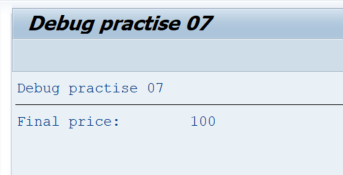
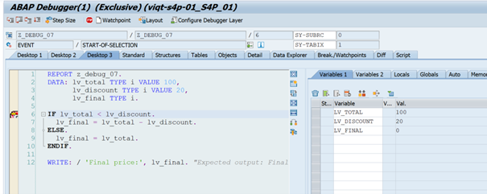
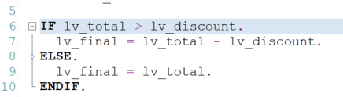

# Debug Task 07

## Steps

1. In **SAP GUI** transaction `SE38`, enter `z_debug_07`, and click **Display**.  
2. Take some time to observe the report to understand the expected outcome. Run the program by clicking **Direct Processing** or by pressing **F8**.  
3. Examine the output.  

4. Go back to the report (**Back** or **F3**).  
5. Put a debugger point on **line 6**, and run the program by clicking **Direct Processing** or by pressing **F8**.  
   - Inspect variables `lv_total`, `lv_discount`, and `lv_final`.  
   - Observe how the logic of the **IF statement** executes.  

6. The unexpected behaviour is caused by accidentally switching the IF condition.  
7. Make sure to press **Continue** or **F8** if the debugger is not finished, then go back to the report page.  
8. Click on **Display/Change** or press **CTRL + F1**. The screen should turn white.  
9. Modify the code so the IF statement's condition is reversed. You can do this by either:  
   - Changing the `<` sign to a `>` sign, or  
   - Replacing `lv_discount` with `lv_total`.  

**OR**

10. Click **Activate** or press **CTRL + F3**.  
11. Make sure you still have a debugger point set on **line 6**, then run the debugger again.  
12. Inspect the flow of the IF statement again and examine the final output.  
