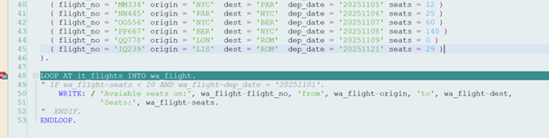
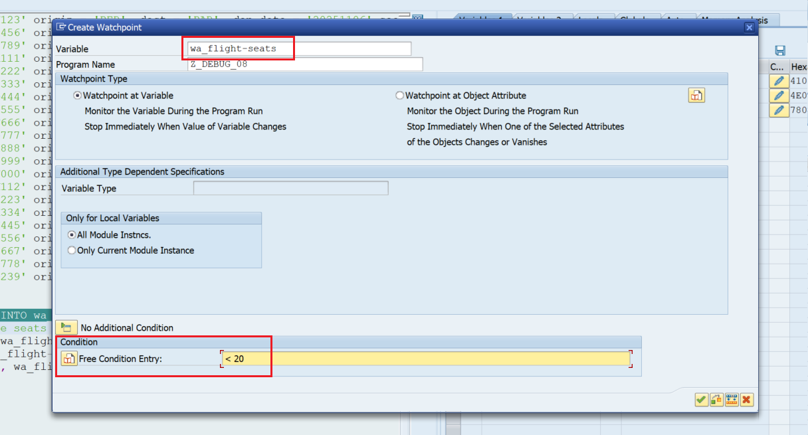
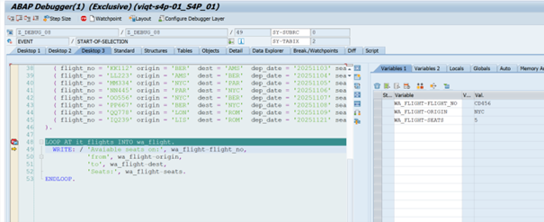
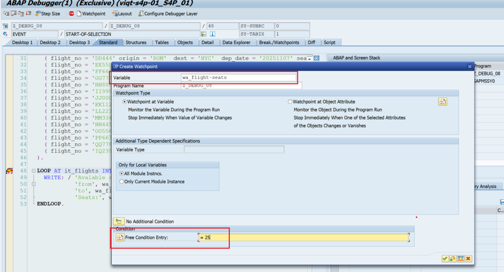
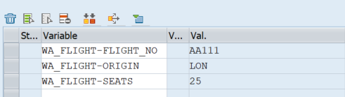
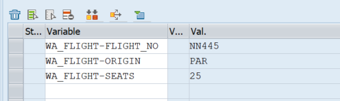
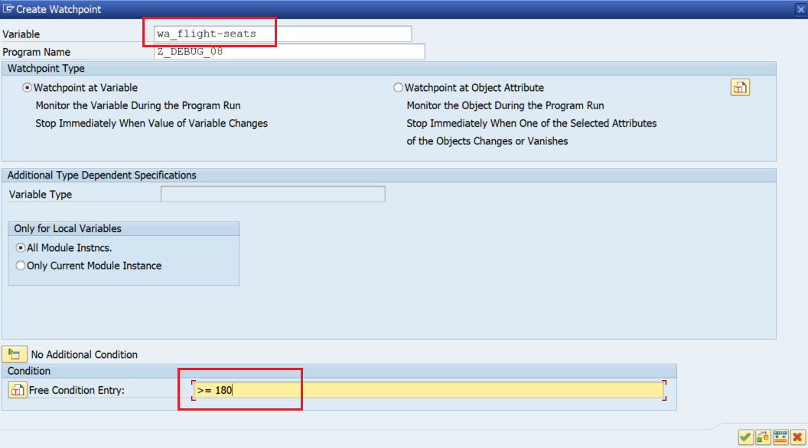
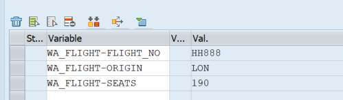
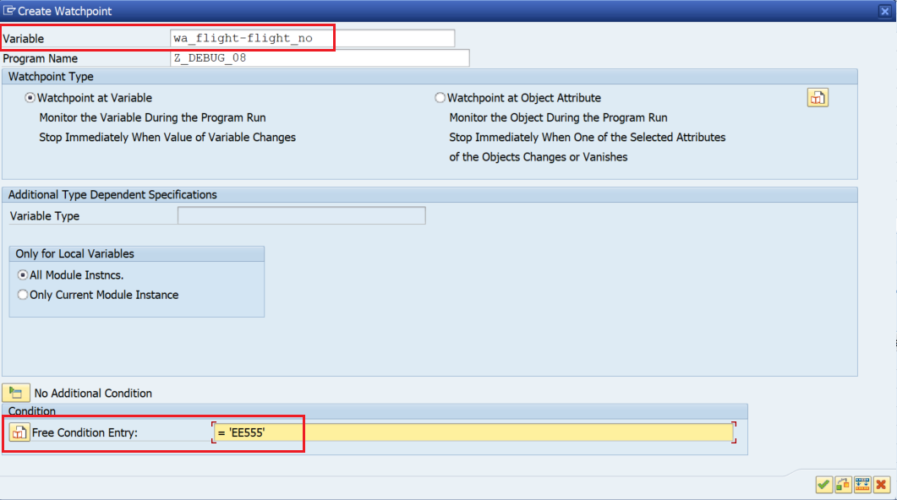
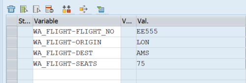

# Debug Task 08

This task doesn’t have a bug. Its aim is to practice setting **watchpoints**. Add your own user number after the report name instead of XZ. For example, ‘Z_DEBUG_08_USER01’.

## Steps

1. In **SAP GUI** transaction `SE38`, enter `Z_DEBUG_08_USERXZ`, and click **Display**.  
2. Run the program by clicking **Direct Processing** or by pressing **F8**.  
3. Examine the output.  
4. Go back to the report. Set a debugger point on **line 49**. Start the debugging process (**Direct Processing** / **F8**). 

5. Double-click variables `wa_flight-flight_no`, `wa_flight-origin`, and `wa_flight-seats`. Observe how the values change by pressing **Continue** or **F8** a couple of times.  

6. The **LOOP** statement normally goes line by line, processing all 30 lines of the internal table. With watchpoints, you can focus on only a subset of values.  
7. Let the report execute fully by right-clicking the debugger point and choosing **Delete debugger point**. Click **Continue** or press **F8**. The report should finish processing. Go back to the report.  
8. To set a watchpoint, make sure you have a debugger point at **line 48**. Once the debugger stops at the LOOP statement, click the **Watchpoint** button in the menu bar, or press **Shift + F4**. A window will pop up. 

9. In the **Variable** field, write `wa_flight-seats`. This variable will be observed by the program.  
10. In the **Free Condition Entry**, write `< 20`. Make sure there is a space between `<` and `20`, or the condition will throw an error. This is the condition for which the program stops when true.  

11. You can set multiple watchpoints if necessary in the **Create Watchpoint** window by clicking **No additional Condition**. For now, one watchpoint for `wa_flight-seats` is sufficient.  
12. Watchpoints disappear automatically once the debugger executes. You need to set them again if you restart the debugger.  
13. Double-click variables `wa_flight-flight_no`, `wa_flight-origin`, and `wa_flight-seats` again to see their values. Click **Continue** or press **F8** multiple times to see the values change. Observe that only the values meeting the watchpoint condition show up.  

14. Let the report finish processing.  
15. Go back to the report.  

16. Using what you learned about watchpoints, answer the following questions:

- **What is the flight_no of the planes that have exactly 25 seats available?**  
  **Answer:** 2  

  
  
  
  

- **How many planes have 180 or more seats available?**  
  **Answer:** 3  

  
  
  
  

- **What is the destination of the plane that has flight number `EE555`?**  
  **Answer:** AMS  

  
  

