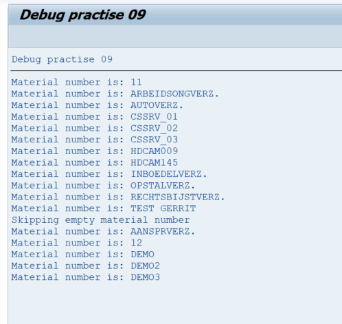
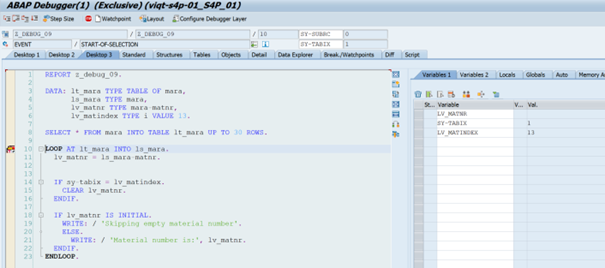
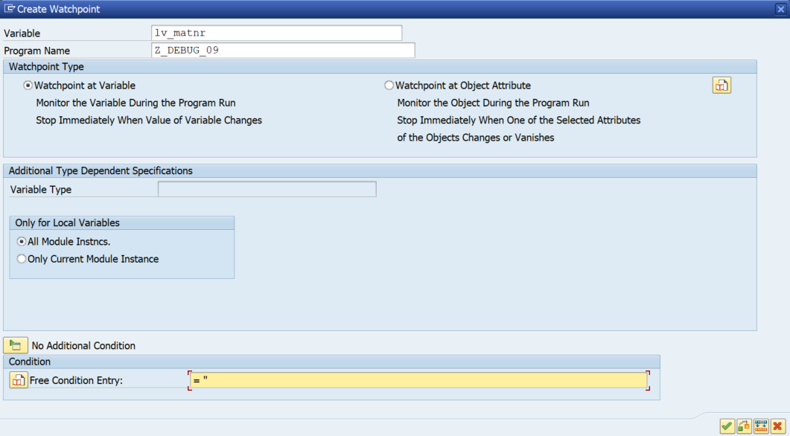

# Debug Task 09

Add your own user number after the report name instead of XZ. For example, ‘Z_DEBUG_09_USER01’.

## Steps

1. In **SAP GUI** transaction `SE38`, enter `Z_DEBUG_09_USERXZ’`, and click **Display**.  
2. Run the program by clicking **Direct Processing** or by pressing **F8**.  
3. Examine the output.  

4. Go back to the report. Set a debugger point on **line 10**, and start **Direct Processing** / **F8**.  
5. Observe the different variables of the **LOOP** statement and **IF** statement.  
   - **Hint:** You can also double-click `SY-TABIX` to watch its value change.  

   

6. Set a watchpoint to observe when `lv_matnr` is skipped.  
   - **Hint:** You can set a watchpoint to trigger when the watched variable is empty by typing `= ''` in the **Free Condition Entry**.  
   - Make sure to leave a space after the `=` sign to avoid an error in the condition.  

   

7. The material number on **line 13** is skipped because it satisfies the condition for the **IF** statement (`SY-TABIX = lv_matindex`), and the material number for that row is cleared.  

